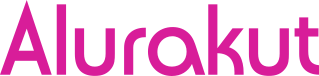
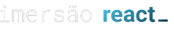
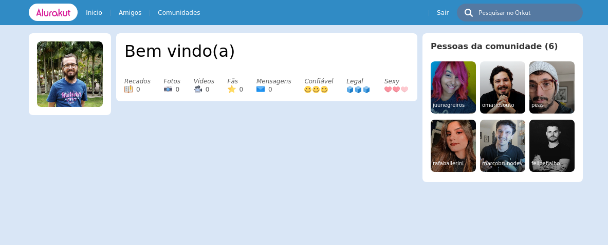

# Alurakut ✨

Projeto desenvolvido durante a 3ª edição da Imersão React promovida pela [Alura](https://www.alura.com.br/).



## Tecnologias
 - [React](https://reactjs.org)
 - [Next.JS](https://nextjs.org/)
 - [styled-components](https://styled-components.com/)


## Instalação das dependências
```bash
yarn install
# ou
npm install
```

## Como executar o projeto

```bash
yarn dev
# ou
npm run dev
```

## Etapas
 - Aula 1: Components com React, Styled Components e NextJS
 - Aula 2: React, State e o primeiro Formulário
